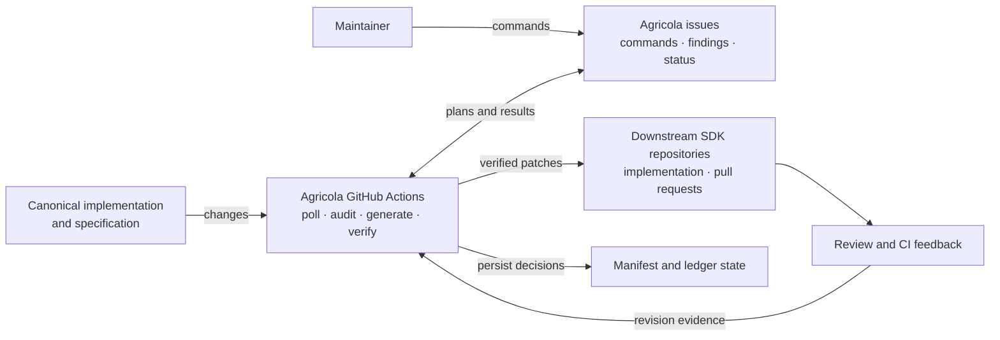

# Agricola

> [!NOTE]
> The primary deployment is the two-agent [Auto control plane](../docs/agricola-auto.md): a read-only scout creates proposal issues, and a maintainer authorizes a draft implementation PR by applying `agricola:approved`. The GitHub Actions deployment below remains available for manual rollback.

Agricola is the GitHub-native control plane for propagating reviewed changes from the canonical `wevm/mppx` SDK to downstream MPP SDKs.

It:

- validates the reviewed [`sdks.yaml`](../sdks.yaml) manifest;
- polls merged canonical pull requests with a durable Git-backed cursor;
- reconstructs authorized `agricola:*` labels as they existed at merge time;
- creates one tracking issue per actionable canonical change;
- accepts maintainer-only `plan`, `fix`, `status`, and `skip` commands;
- generates idiomatic downstream changes, runs each SDK's declared verification, and opens draft pull requests;
- audits every SDK head against canonical `mppx`, clusters deltas, and maintains one issue per finding plus a roll-up index;
- records immutable source snapshots and completed decisions under [`ledger/`](../ledger/).

Agricola never auto-merges a downstream pull request. Maintainers retain review and merge control.

## System interfaces and interactions

Commands are posted only on Agricola-managed issues in `mpp-tools`. Canonical and downstream pull requests provide source state, review feedback, and CI evidence; they do not accept Agricola commands directly.



## Requirements and installation

Agricola requires Python 3.12 or newer and the GitHub CLI (`gh`) for live operations.

```bash
python3.12 -m venv .venv
.venv/bin/pip install -e .
.venv/bin/agricola validate
```

`validate` rejects duplicate YAML keys and unknown fields, then validates the manifest, ledger, and cursor. Pydantic models are the source of truth for validation and generated JSON Schemas:

```bash
.venv/bin/agricola schema > schemas.json
```

No checked-in schema copies need synchronization.

## Configuration

[`sdks.yaml`](../sdks.yaml) is the reviewed source of truth. It contains:

- `maintainers`: GitHub logins authorized to apply effective labels and issue commands;
- `canonical` and `spec`: repository names in `OWNER/REPO` form;
- `sdks`: immutable target definitions keyed by lowercase target name;
- `automation`: `pr` for managed propagation or `notify` for external targets;
- repository, owners, changelog convention, and verification commands for each target.

Set `changelog: fragment` when the target repository requires release-note fragments, or `changelog: none` when release notes are automatic or unnecessary.

Every `automation: pr` target must declare at least one verification command. The executor runs these commands after generation and before it receives downstream write credentials.

## Labels

Apply labels to the canonical pull request before merging:

| Label | Effect |
| --- | --- |
| `agricola:all` | Queue every manifest target with `automation: pr`. |
| `agricola:<target>` | Queue the named target; target labels are additive. |
| `agricola:none` | Disable propagation. A clean `none` result is recorded without a tracking issue. |
| No Agricola label | Record the merge without creating a tracking issue or propagating it. |

Only the last label event at or before merge counts, and its actor must be in `maintainers`. Later label edits cannot change the snapshot. Unknown authorized labels create a diagnostic plan. `agricola:none` wins over other labels, but conflicts and errors remain visible in a diagnostic tracking issue.

The workflow reads canonical label events with a GitHub App installation token. This is required because the `mpp-tools` repository token cannot reliably read cross-repository timeline events.

## Impact plans

Each tracking issue contains the stable marker `<!-- agricola:source=OWNER/REPO#NUMBER -->` and separates changed files into:

1. normative specification or conformance files;
2. canonical behavior worth matching;
3. incidental repository or TypeScript tooling files.

Agricola does not infer SDK applicability from keywords or feature tags. Authorized merge-time labels are required to create a tracking issue from a canonical merge. Maintainer commands can then refine propagation decisions on that issue. Plans show the selected targets and the manifest's general target inventory; `automation: notify` targets remain notification-only.

The tracking issue also contains a durable downstream propagation table. It lists every target as awaiting a decision, queued, skipped, notification-only, or recorded, and links each recorded downstream pull request. Table updates are delivered only after the corresponding ledger state has been persisted.

## Commands

`/ag` must be the first token on a line. Commands are accepted only from configured maintainers and only on canonical-change or audit-finding issues in `mpp-tools`. Accepted commands receive an eyes reaction while the workflow processes them. `/agricola` and the `propagate` verb remain compatibility aliases.

| Command | What it does | Example comment |
| --- | --- | --- |
| `plan` | Regenerates the impact plan from immutable merge-time state. | `/ag plan` |
| `fix [targets...] ["instruction"]` | Queues named `automation: pr` targets, or all when omitted. When a PR is recorded, a quoted instruction revises it using unresolved review feedback and failed CI. | `/ag fix python "address the review comments"` |
| `status` | Queries GitHub for downstream PRs recorded in the ledger. | `/ag status` |
| `skip <target> reason="..."` | Records an idempotent, reason-required skip for one SDK. | `/ag skip go reason="Not applicable to this transport"` |

On an audit-finding issue, `fix` selects every affected PR-enabled SDK. Optional targets limit it to named affected SDKs, and `status` reports linked remediation pull requests. Each actionable issue includes a copy-ready `/ag fix` block. After a pull request is recorded, `/ag fix "instruction"` checks out its exact head, collects unresolved trusted review feedback and failed CI, makes an incremental verified revision, and posts a summary to the same pull request. The finding's exact canonical and target commits are the immutable initial-generation inputs. `plan` and `skip` remain specific to canonical-change issues.

Commands in canonical or downstream repositories are not supported. A failed unpublished propagation can be retried by repeating its issue command or rerunning its workflow; a published stable branch is updated idempotently.

## Downstream execution

Every source-target pair uses a stable branch such as `agricola/mppx-412` for a canonical change or `agricola/agr-2026-022` for an audit finding. The source identity and target define a stable idempotency key, so overlapping polls and repeated commands do not create duplicate pull requests.

The executor pins the target repository's default-branch commit when it creates a
propagation request. Generation, verification, and publication all use that exact
target tree, even if the default branch advances while the workflow is running.

The executor:

1. checks out the downstream repository, pinned canonical commit, specification, reviewed plan or audit evidence, and target conventions;
2. generates the smallest idiomatic downstream patch and runs the manifest verification commands without repository write credentials; revisions begin at the recorded PR head and include bounded, untrusted review and CI evidence gathered with a read-only token;
3. transfers only that patch to a separate job and independently repeats the manifest verification commands without secrets;
4. mints a target-scoped GitHub App token only after verification succeeds;
5. creates or updates the stable branch and opens a draft pull request;
6. records the propagation decision only after GitHub returns the pull-request reference.

Every downstream pull request uses the standard Motivation, Summary, and Key design considerations sections. Its description names the behavior or finding, links the originating Agricola ticket, and records the exact canonical and target commits used for generation.

If the canonical behavior is absent from a target SDK, the generator returns an explicit reason instead of a patch. Agricola records that result as a skip, updates the tracking table, and does not run verification or request downstream write credentials. An unexplained empty patch remains a generation failure.

Generation and verification failures leave no decision, so the same request remains retryable. Explicit skips and successful publications are recorded even when another target in the same matrix fails. A post-push retry recognizes its request-keyed commit and summary comment, then resumes recording without rewriting the branch or posting the summary twice. A closed stable pull request must be reopened before retrying. An existing ready-for-review pull request is returned to draft before its branch is updated, and a merged pull request is treated as the completed result.

## Recurring audit

The weekly and manually dispatched audit is head-to-head and report-only. It uses `mppx` as the sole reference and evaluates every manifest SDK independently, including notification-only targets.

Each repository's current default-branch checkout is reviewed independently against the exact canonical `mppx` head. A read-only Codex run explores both implementations and emits schema-validated `semantic:<area>/<behavior>` findings with source evidence. Shared protocol vectors and conformance-adapter capabilities provide deterministic supporting evidence. The roll-up groups identical fingerprints such as `semantic:receipt/verification-order`, `capability:challenge.parse`, or `vector:www-authenticate/basic/parse`. Stable `AGR-<year>-<sequence>` IDs are assigned in [`ledger/audit.json`](../ledger/audit.json).

One `[Agricola] SDK drift audit` index is updated in place, and every stable finding gets its own issue with exact audited commits, affected SDKs, deterministic clean results, semantic findings not reported by other reviews, severity, confidence, linked source evidence, a suggested test, and action instructions. A missing semantic finding is not evidence that an SDK is clean. A healthy audit closes issues whose fingerprints disappear and reopens recurring findings. Incomplete audits never close findings. Findings never create branches or pull requests automatically; a maintainer may explicitly run `/ag fix` on the finding issue to open or update draft remediation pull requests. Their links and status survive later audit reconciliations.

## State and recovery

The poller creates `ledger/cursor.json` on its first run. Every state writer restores only `ledger` from `agricola/state`, applies its idempotent operation on trusted default-branch code, and pushes a complete snapshot guarded by the state commit it read. If another writer wins first, Git rejects the stale lease and Agricola replays the operation on the newer ledger. A stable state pull request checkpoints the result on the default branch. Merge it, but do not close or edit it manually. The next state change creates or updates its successor, so at most one state pull request remains open.

Executable control-plane code always comes from the protected default branch. The initial cursor starts fifteen minutes behind the current time; combined with the one-hour replay overlap, the first API read covers approximately the previous 75 minutes. Later polls retain the overlap and deduplicate using source snapshots and decisions.

Ledger filenames identify the canonical repository and pull request. Entries contain immutable source metadata, the authorized merge-time label snapshot, and discriminated decisions:

- `skip` requires a reason and forbids a pull-request reference;
- `propagate` requires a downstream pull-request reference and is written only after publication.

The separate `ledger/audit.json` registry maps stable fingerprints to finding IDs. It does not store mutable CI or pull-request lifecycle state.

Tracking issue deduplication scans the control repository's issue API directly for the stable marker; it does not depend on search indexing.
New tracking and audit issues receive the `agricola` label plus one label for every affected SDK. The audit index receives only `agricola`. Agricola creates missing labels before opening an issue.

State-changing replies are deferred until the guarded state push succeeds and the state pull request has been ensured. A failed state update therefore cannot leave a misleading acknowledgement. Reruns reuse deterministic idempotency keys.

## CLI reference

| Command | What it does | Example |
| --- | --- | --- |
| `agricola validate` | Validates the manifest and all durable ledger state. | `agricola validate` |
| `agricola schema` | Prints generated manifest and ledger JSON Schemas. | `agricola schema > schemas.json` |
| `agricola token-scope` | Prints the manifest-derived GitHub App scope for PR-enabled SDKs. | `agricola token-scope` |
| `agricola poll` | Processes newly merged canonical pull requests. | `agricola poll --control-repo tempoxyz/mpp-tools` |
| `agricola handle-comment [event]` | Parses an `issue_comment` payload; defaults to `GITHUB_EVENT_PATH`. | `agricola handle-comment event.json` |
| `agricola deliver-reply <file>` | Posts a deferred reply, optionally linking its Actions run. | `agricola deliver-reply reply.json --action-url "$RUN_URL"` |
| `agricola deliver-issue-update <file>` | Applies a deferred tracking-issue body update. | `agricola deliver-issue-update update.json` |
| `agricola record-propagations <results>` | Records published PRs or explicit skips and renders deferred updates. | `agricola record-propagations results --reply-directory replies --issue-update-directory updates` |
| `agricola audit-matrix` | Builds the SDK audit matrix from the manifest and adapters. | `agricola audit-matrix --adapters conformance/adapters` |
| `agricola audit-semantic-schema` | Prints the strict semantic-review output schema. | `agricola audit-semantic-schema > semantic.schema.json` |
| `agricola audit-snapshot` | Normalizes one SDK's conformance and semantic results. | `agricola audit-snapshot --target go --repo tempoxyz/mpp-go --sha "$SHA" --adapter-manifest adapter.json --results results.json` |
| `agricola build-audit <snapshots>` | Clusters snapshots, assigns stable IDs, and renders issue payloads. | `agricola build-audit snapshots --report-file audit.json` |
| `agricola deliver-audit <report>` | Reconciles the roll-up index and per-finding GitHub issues. | `agricola deliver-audit audit.json --control-repo tempoxyz/mpp-tools` |
| `agricola verify-propagation <request>` | Runs the target's reviewed verification commands. | `agricola verify-propagation request.json --root downstream-sdk` |
| `agricola collect-revision-feedback <request>` | Collects trusted unresolved review feedback and failed CI for the request's exact PR head. | `agricola collect-revision-feedback request.json --output revision.md` |
| `agricola render-propagation <request>` | Renders deterministic downstream PR metadata. | `agricola render-propagation request.json --title-file title.txt --body-file body.md` |
| `agricola publish-propagation <request>` | Publishes one verified commit idempotently to its stable draft pull request. | `agricola publish-propagation request.json --title-file title.txt --body-file body.md --output result.json` |
| `agricola state-transaction -- <command>` | Replays a ledger-writing command until its guarded state-branch push succeeds. | `agricola state-transaction -- agricola poll` |
| `agricola parse-command --author <login>` | Parses issue commands from standard input for diagnostics. | `printf '%s\n' '/ag status' \| agricola parse-command --author maintainer` |

Live control-plane commands authenticate through `GH_TOKEN`; canonical polling can use a separate repository token:

```bash
GH_TOKEN=... AGRICOLA_CANONICAL_TOKEN=... \
  .venv/bin/agricola poll --control-repo tempoxyz/mpp-tools
```

See [Agricola Actions setup](../docs/agricola-actions.md) for GitHub App, secret, and deployment configuration.

## Development verification

With Ruff, `ty`, `uv`, Go, and Actionlint available:

```bash
uv sync --locked --group dev
uv run --locked coverage run -m unittest discover -s agricola/tests -v
uv run --locked coverage report
uv run --locked ruff format --check agricola
uv run --locked ruff check agricola
uv run --locked ty check agricola
go run github.com/rhysd/actionlint/cmd/actionlint@v1.7.7 .github/workflows/agricola.yml .github/workflows/agricola-audit.yml
```
